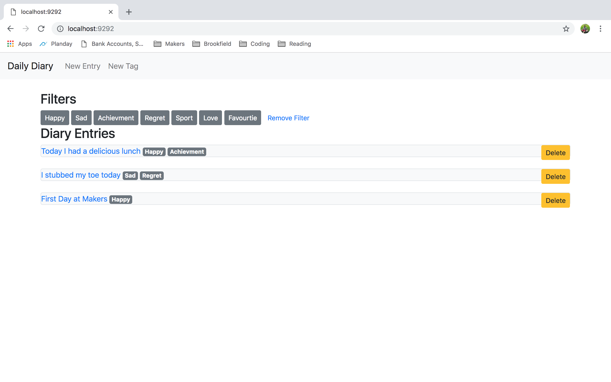
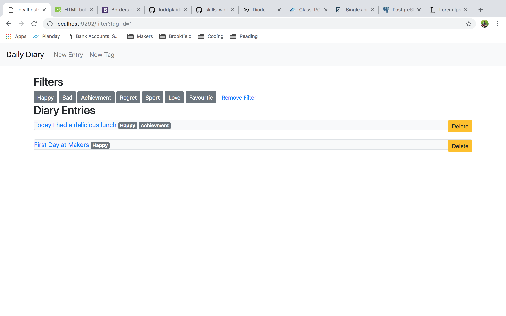
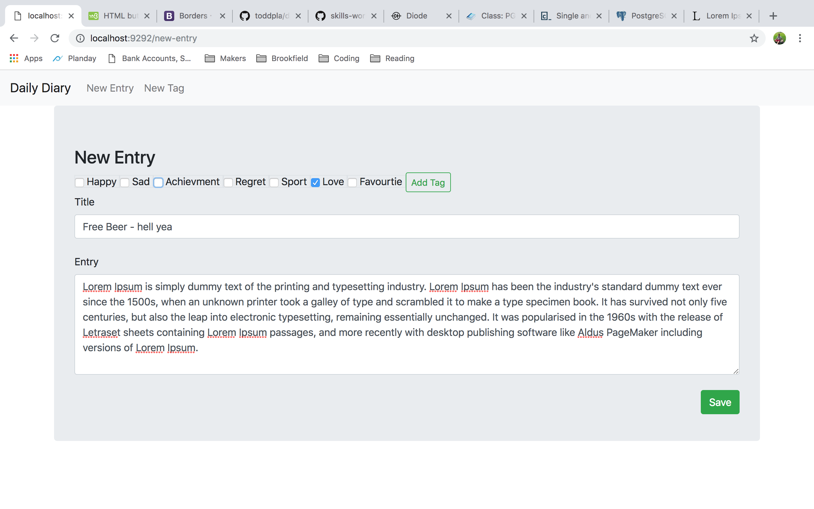
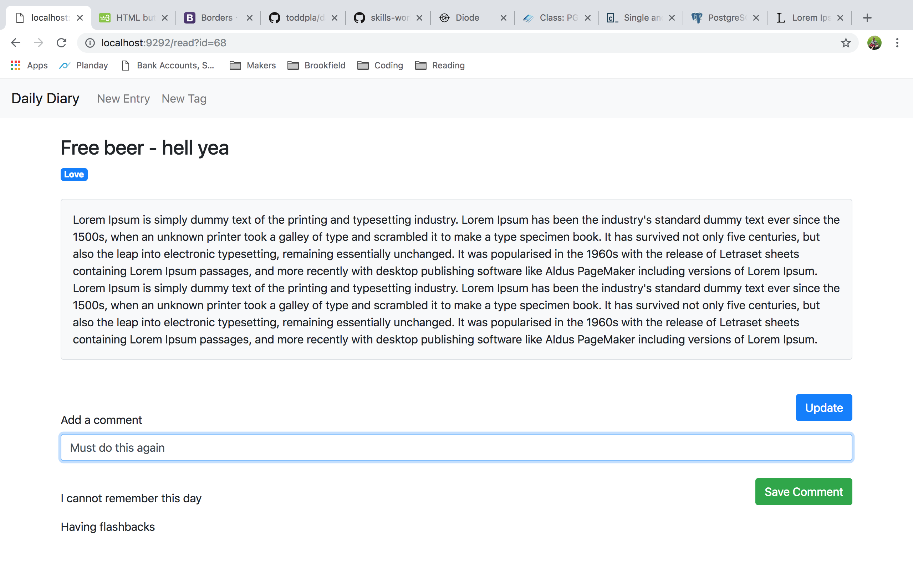
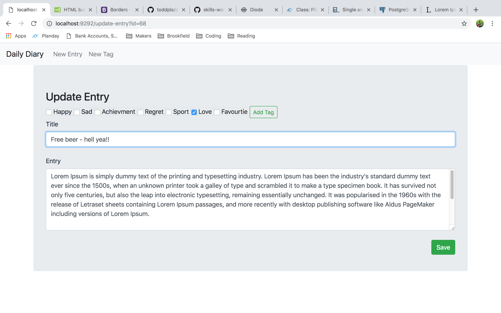
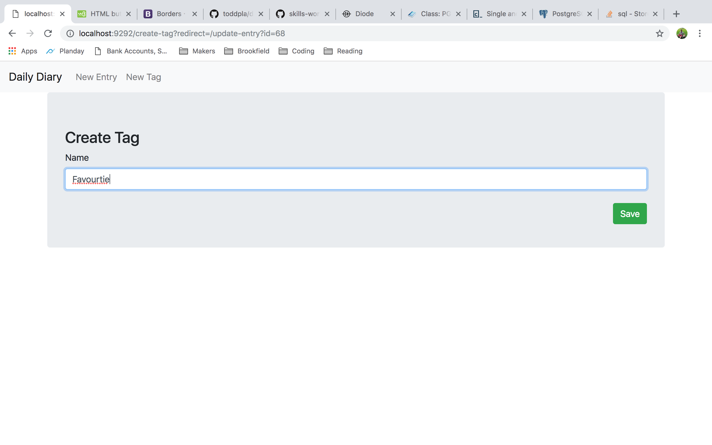

# Daily Diary

### Setup

#### Prerequisites

PostgresSQL
```sh
$ psql -V
```
if installed expect something like
```sh
psql (PostgreSQL) 10.5
```
if not installed then

```sh
$ brew install postgresql
```

#### Clone and install

```sd
$ git clone https://github.com/toddpla/daily-diary.git

$ cd daily-diary

$ bundle
```
#### Database migrations
Create two database named:
1. 'diary'
2. 'diary_test'

Then run the migrations in the db/migrations directory for both databases.


### Run
```
rackup
```
In your browser visit localhost:9292

### Screenshots

##### homepage: /

1. View all entries
2. Filter entries by tag
3. Select entry to be deleted
4. Select entry to be read



##### filter
The entries can be filtered by the tags listed at the top of the screen

The filter can be removed by selecting 'Remove Filter'



##### create new entry: /new-entry

1. Select the tags
2. Add new tag
3. Enter a title
4. Enter a diary entry



##### view entry: /read?id=
1. View the tags
2. View the title
3. View the diary entry
4. Enter a comment
5. View previous comments




##### update entry: /udpate-entry?id=
1. Update the tags
2. Update the title
3. Update the diary entry



##### create tag: /create-tag
1. Enter a new tag


